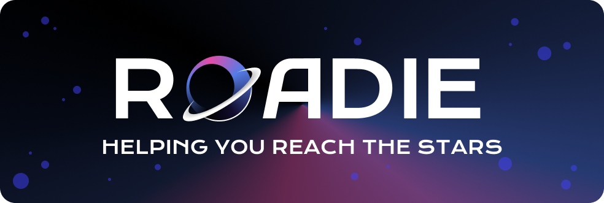

# Roadie — Plataforma Imersiva de Aprimoramento Profissional

# Sobre Nós
A Roadie é uma plataforma de aprimoramento e transição profissional que projeta um universo virtual imersivo estruturado em roadmaps, permitindo pessoas de múltiplas gerações se adaptarem às novas exigências do mercado de trabalho. O usuário descobrirá profissões emergentes mais afinadas aos interesses e habilidades que já possui, promovendo evolução ou suave transição profissional através de constelações de requisitos técnicos e didáticos que se interligam dentro do que apelidamos de formaverso.
 
Ao longo da jornada, um currículo personalizado e dinâmico é construído, permitindo empresas parceiras acessá-lo e realizar recrutamentos. Instituições de ensino poderão fornecer novas estrelas – cursos relacionados – enriquecendo constelações e oferecendo progressão de aprendizado ao usuário, para que assim avance sua carreira com propósito.

A proposta da Roadie é preparar profissionais para as inovações e demandas que as novas tecnologias e profissões passarão a exigir ao decorrer do tempo. Almejamos que as pessoas vejam a tecnologia como sua colega de trabalho, e não como suas substitutas, visto que o avanço e evolução tecnológica é inevitável e necessária.

A Roadie ambiciona ser democrática a todos, buscando não apenas estar presente no meio acadêmico em parceria com universidades e plataformas de cursos como Alura e Udemy, mas também no meio profissional, em parceria com empresas, promovendo incentivos ao estudo por meio de oportunidades de emprego e entrevistas.

---

## 📚 Sumário
- [Sobre o Projeto](#sobre-o-projeto)
- [Tecnologias e Versões](#tecnologias-e-versões)
- [Arquitetura](#arquitetura)
- [Como Executar o Projeto](#como-executar-o-projeto)
  - [Pré-requisitos](#pré-requisitos)
  - [Instalar dependências](#instalar-dependências)
  - [Rodar a aplicação](#rodar-a-aplicação)
- [Porta Padrão](#porta-padrão)
- [Endpoints e Exemplos de Requisição](#endpoints-e-exemplos-de-requisição)
  - [Usuários](#usuários)
  - [Trilhas](#trilhas)
  - [Inscrições](#inscrições)
- [Autores](#autores)

---

## 🎯 Sobre o Projeto

A Roadie é um sistema de gerenciamento de trilhas e usuários.  
O projeto permite:

- Cadastro, edição, exclusão e listagem de **usuários**
- Cadastro, edição, exclusão e listagem de **trilhas de aprendizagem**
- Inscrição e cancelamento de inscrição de usuários em trilhas
- Validações e tratamento de erros com **status HTTP apropriados**
- Interface usando Thymeleaf
- Backend estruturado com Spring Boot seguindo arquitetura MVC

---

## 🛠 Tecnologias e Versões

- **Java:** *21*
- **Spring Boot:** *3.5.7*
- **Banco de Dados:** *MySQL*
- **Maven**

---

## Principais dependencias Spring & Maven:

- **MySql Driver:** *MySQL JDBC driver.*
- **Spring Data JPA:** *Persist data in SQL stores with Java Persistence API using Spring Data and Hibernate.*
- **Spring Web:** *Build web, including RESTful, applications using Spring MVC. Uses Apache Tomcat as the default embedded container.*
- **Thymeleaf:** *A modern server-side Java template engine for both web and standalone environments. Allows HTML to be correctly displayed in browsers and as static prototypes.*

## 🏗 Arquitetura

O projeto segue arquitetura MVC. Estrutura das pastas:

📁 src/main/java/com/GlobalSoluion/DDD/Roadie
  - controller/ → Controladores (rotas, views)
  - service/ → Regras de negócio
  - repository/ → Persistência (Spring Data JPA)
  - model/ → Entidades JPA
  - exceptions/ → Exceptions personalizadas + handler global

## Como Executar o Projeto:
  - **1. Pré-requisitos**
    - **Antes de iniciar, certifique-se de ter instalado:**
      - **Java 21**
      - **Git**
      - **Uma IDE (IntelliJ, VS Code, Eclipse – opcional)**
        
  - **2. Clonar o Repositório**
  (No terminal de sua IDE)
  ```bash
    git clone https://github.com/sannunez/RoadieApiRest-GlobalSolution-DDDJAVA.git
  ```
  - **3. Abrir repositório**
  - **4. Instalar dependencias Maven**
  (No terminal de sua IDE)
```bash
mvn clean install
```

